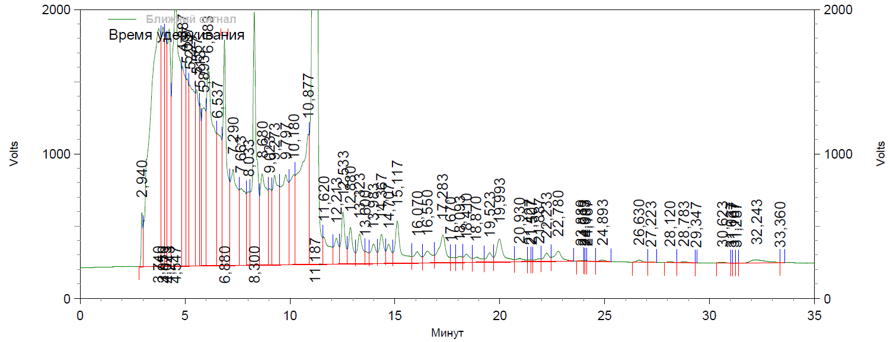

# Техническое задание #

## приложение 2 ##

Образец графика представлен на рисунке.

### Внешняя форма приложения. ###

Приложение должно запускаться в виде формы в стандартном отдельном окне.  
На форме должны быть размещены:  

1. Область с координатной сеткой для демонстрации графика (ось X: Минут, от 0 до 35, шаг 1 мин, обозначение каждой пятой минуты, ось Y: справа и слева, Volts, от 0 до 2000, шаг 100, обозначение: 0, 1000, 2000).
2. Поля для ввода значений в программу:
   * поле для ввода даты;
   * поле для ввода времени;
   * поле для ввода имени файла (шифр образца);  
   * параметры (можно в виде таблицы, колонки) «Время удержания» (с точностью до 0,001 мин), «Площадь» (имеет разрядность х107, т.е. введя в форму 3,26, мы должны в таблице получить ~32596523 = 3,26х107 + остаток случайный, по правилам округления);
   * значения (строка, в колонке «Время удержания» максимум 5 знаков, в колонке «Площадь» максимум 3 знака), количество строк – 4.
3. Кнопки управления: Создать график, Очистить график, Выгрузить график в файл, Выгрузить отчет в файл.

### Предполагаемая работа программы. ###

После заполнения полей на форме (с проверкой заполнения, дата – это дата, время – это время, шифр образца не пустое, значения  - числа) при нажатии кнопки «нарисовать график», программа должна рассчитать случайные значения «времени удержания», случайные значения «площади» пиков, «процент площади», зависящие от площади, значения «высоты» пика, «процент высоты»:  
  
Основной график расположен на уровне от 200 до 300 Volts.   
  
«Время удержания» генерируется случайным образом, за исключением введенных значений (в минутах с точностью до 0,001, каждое следующее временное значение должно быть больше предыдущего), вводятся значения: первое – в районе 3 минут (2,895 – 3,150), следующее – в районе 9 – 11 минут (в этом интервале график должен колебаться в диапазоне от 1200 до 1800 Volt, отдельные пики (2 -3 штуки) могут уходить за пределы графика), далее график должен снижаться с +200 Volt до оси графика (200 – 300 Volt);  
  
«Площадь» генерируется случайным образом, за исключением введенных значений;  
  
«Высота» находится в корреляционной зависимости от «площади» (надо как-то ее посчитать);  
  
Количество временных интервалов берется случайным образом из диапазона от 60 до 80 интервалов;  
  
вывести изображение графика на экран.  
  
Впадины должны быть напротив рассчитанных и заданных временных значений.  
  
Впадина маркируется вертикальной красной чертой (размер, от общей оси графика до точки на графике, но не менее 100 Volts), вертикальной надписью содержащей: время пика, горизонтальной красной чертой (см. образец) под впадиной.

### Отчет, документ MS Word ###

Выгружаемый в документ MS Word отчет должен содержать (см. образец):  

- надпись _«Страница 1 из Х»_ (из сколько страниц получится)
- шапка документа «**RU006111MA**»
- надпись «_C:\EZChrom Elite\Enterprise\Projects\Default\Method\ПХБ.met_»
- надпись «_Имя файла данных:C:\Documents and Settings\user\Рабочий стол\ПХБ\ХХХ-ХХХ.dat_», где ХХХ-ХХХ – шифр образца, вводится в форму.
- надпись «_Метод:C:\EZChrom Elite\Enterprise\Projects\Default\Method\ПХБ.met_»
- надпись «_Получено:_ **дата, время**» (вводятся в форму)
- рисунок графика
- таблица (см. образец), строка «_Итого_» - должна быть рассчитана по полученным значениям, проценты соответственно не больше 100. )
